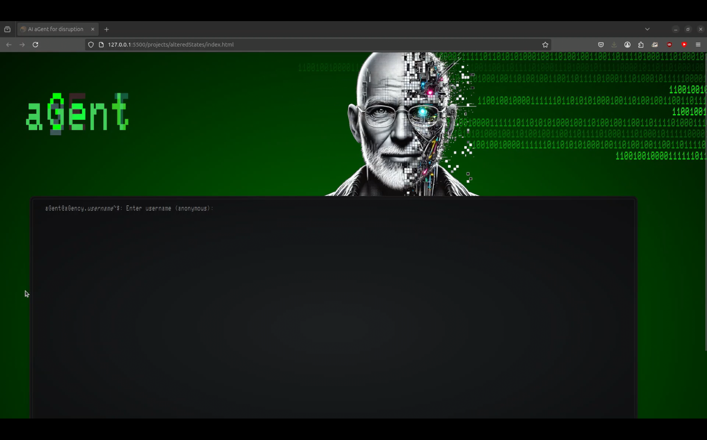

# aGent by ai.Gency
## Working name: alteredStates
### Purpose
To try out styling and page layout using advanced css and a little javascript
### Design Concept
- dystopian aesthetic
- android based AI
- animations to illustrate data transfer
- bash terminal styling for input
### Challenges
1. item placement is tricky
2. battled with ChatGPT 4.0 CoPilot to generate binary stream
3. glitchy text required *display:absolute* and *Z-index:100* to work
4. input form will be a challenge and may not be well received by users
### Previews
<video controls src="alterStatesConcept.mp4" title="Title"></video>

